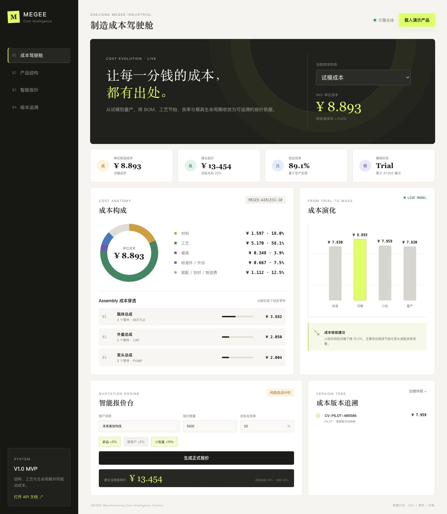

# MEGEE Manufacturing Cost System V1.0

制造结构、工艺数据和模具生命周期驱动的成本演化与报价 API。系统将 SKU 作为报价容器，成本实际在 Assembly、Part、Routing、Mold 和生产实绩层计算。



## 已实现能力

- SKU -> Assembly -> Part 产品结构
- 自制件、标准件、外协件三类成本
- 独立 Routing 工艺和设备/人工费率
- Trial / Pilot / Mass 生产实绩修正
- 现场数据实时试算，逐步展示节拍、良率和工序成本公式
- 现场生产数据录入与 CSV 批量导入
- 待审批数据隔离、批准生效、驳回留痕
- 数据批准后自动重算成本并生成成本版本
- 模具剩余价值和剩余产量摊销
- 成本版本父子树、快照和字段级 Diff
- 新品、新客户、小批量、外协风险加成
- 目标毛利率报价与报价记录持久化
- SQLite 默认运行，`DATABASE_URL` 可切换到 SQLAlchemy 支持的数据库
- 中文成本驾驶舱，一键载入瓶 + 泵 + 盖演示产品
- Alembic 数据库迁移和 GitHub Actions 自动测试
- 推送分支后自动构建 GHCR 容器镜像

## 本地启动

```bash
cd /Users/coady/Documents/Codex/megee-cost-system
python3 -m venv .venv
source .venv/bin/activate
pip install -e '.[dev]'
uvicorn app.main:app --reload
```

打开 `http://127.0.0.1:8000` 进入成本驾驶舱，点击“载入演示产品”即可体验完整流程。

API 文档位于 `http://127.0.0.1:8000/docs`。

## Docker 启动

```bash
docker compose up --build -d
curl http://127.0.0.1:8000/health
```

数据库保存在 Docker volume `megee-data` 中。

## 数据库迁移

```bash
alembic upgrade head
```

Docker 容器启动时会自动执行待应用迁移。生产环境可通过 `DATABASE_URL` 切换 PostgreSQL，例如：

```text
postgresql+psycopg://user:password@db:5432/megee_cost
```

## API

| Method | Path | Purpose |
| --- | --- | --- |
| `POST` | `/catalog/import` | 原子导入或更新完整主数据 |
| `GET` | `/catalog/skus` | 查询 SKU 主数据摘要 |
| `POST` | `/sku/calculate` | 展开 SKU 并返回组件/零件成本明细 |
| `POST` | `/cost/compute` | 计算 Standard/Trial/Pilot/Mass/Adjusted 成本 |
| `POST` | `/production/input` | 输入人工生产记录 |
| `POST` | `/cost-data/preview` | 用待录入数据实时试算，不写入正式成本 |
| `POST` | `/cost-data/submissions` | 提交单条现场生产数据，进入待审批池 |
| `POST` | `/cost-data/import` | 批量导入生产数据，全部进入待审批池 |
| `GET` | `/cost-data/submissions` | 查询待审、已批准或已驳回数据 |
| `POST` | `/cost-data/submissions/{id}/approve` | 批准数据、写入实绩、重算并生成版本 |
| `POST` | `/cost-data/submissions/{id}/reject` | 驳回数据并保留审核记录 |
| `POST` | `/mold/update` | 更新模具累计产量和生命周期 |
| `POST` | `/quotation/generate` | 生成并保存报价 |
| `POST` | `/cost/version/create` | 创建成本版本及不可变快照 |
| `POST` | `/cost/version/diff` | 比较两个成本版本 |
| `GET` | `/cost/versions/{sku_id}` | 查询 SKU 版本时间线 |
| `GET` | `/quotations/{sku_id}` | 查询最近报价记录 |

## 关键计算口径

标准工艺成本：

```text
((machine_rate + labor_rate * labor_count) * cycle_seconds / 3600) / standard_yield
```

有生产实绩时：

```text
process_factor = weighted_actual_cycle / standard_cycle
yield_cost_factor = input_qty / good_qty
actual_process_cost = raw_process_cost * process_factor * yield_cost_factor
```

原始规格中的 `good_qty / total_qty` 是生产良率，不是成本放大系数。若直接乘入成本，会出现良率越低、成本越低的反向结果，因此实现中使用其倒数作为成本因子。

报价采用目标毛利率口径：

```text
risk_adjusted_cost = total_cost * (1 + total_risk_rate)
unit_price = risk_adjusted_cost / (1 - target_margin)
```

## 测试

```bash
pytest
```

测试覆盖主数据导入、标准成本、试模成本演化、生产数据校验、模具更新、成本版本树、Diff 和报价完整流程。

## 现场数据治理

驾驶舱的“现场成本数据采集”支持直接填报和 CSV 导入。新数据首先保存为 `pending`，此时不会参与任何成本或报价计算。审核人批准后，系统在同一事务中：

1. 写入正式生产实绩。
2. 使用批准后的数据重新计算对应 Trial、Pilot 或 Mass 成本。
3. 创建带父版本关系的成本快照。
4. 保存采集人、审核人、意见、生效记录和版本编号。

驳回数据会永久保留为审计记录，但不会进入成本引擎。

现场人员可以先选择成本阶段和零件工序，再输入投入数量、良品数量与实际周期。页面会立即展示：

1. 设备费率与人工费率合成的小时费率。
2. 标准节拍对应的标准工艺成本。
3. 实际加权周期形成的节拍修正因子。
4. 累计投入与良品形成的良率成本因子。
5. 若该数据获批，该工序和对应 SKU 成本预计如何变化。

实时试算只调用 `/cost-data/preview`，不会创建生产记录、审批单或成本版本。现场人员点击“提交审批”后才生成待审记录；审核人点击“批准采用”后，数据才进入正式成本口径。

## GitHub 发布

仓库内的 `MEGEE Cost System CI` workflow 会在相关分支更新时：

1. 使用 Python 3.12 安装并运行测试。
2. 在全新数据库上执行 `alembic upgrade head`。
3. 构建并推送容器至 `ghcr.io/<repository-owner>/megee-cost-system`。
